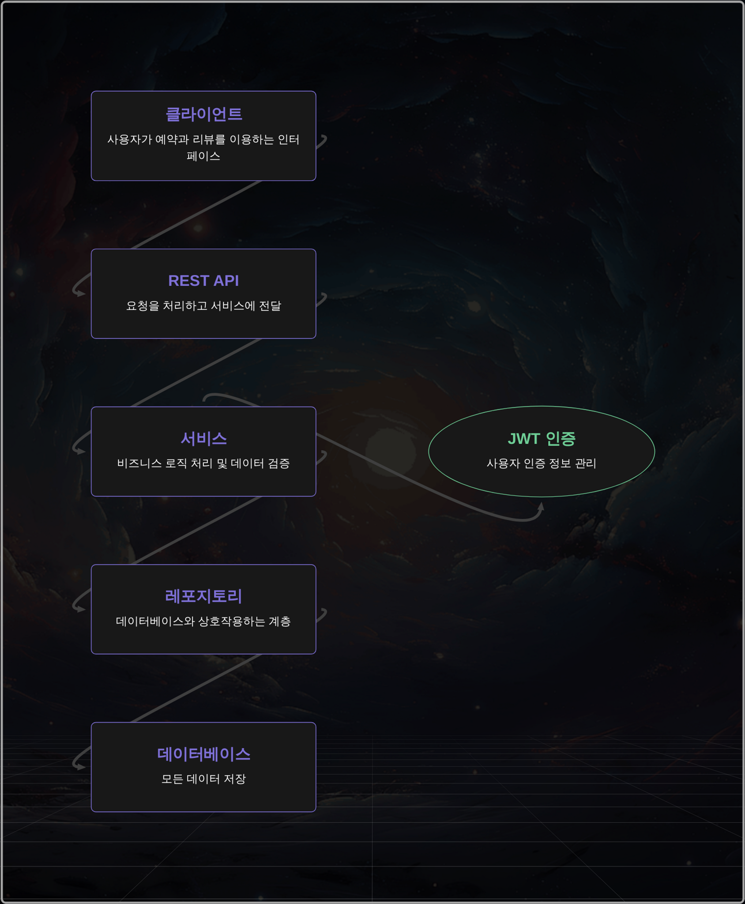
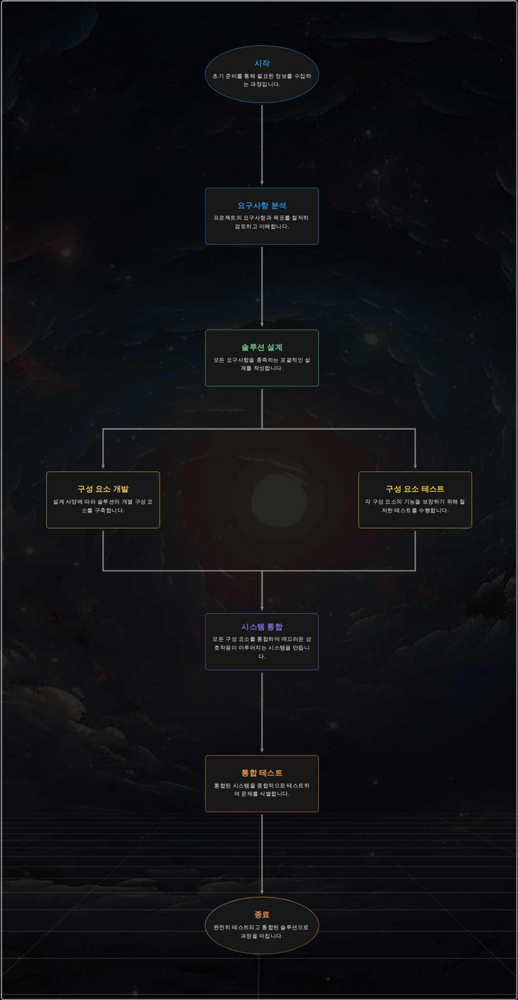
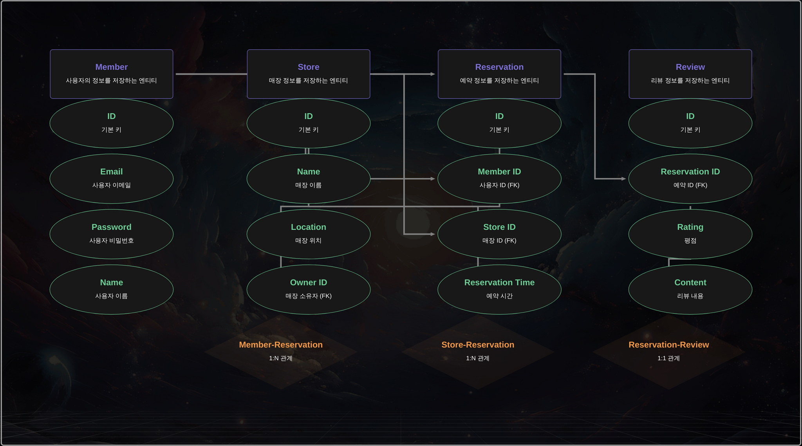

```markdown
# 🏪 매장 예약 및 리뷰 관리 시스템

## 📝 프로젝트 소개

이 프로젝트는 매장 예약 및 리뷰 관리를 위한 REST API 서비스입니다.

- **파트너(점장)**는 매장을 등록하고 예약을 관리할 수 있습니다.
- **일반 사용자**는 매장을 검색하고 예약한 후 리뷰를 작성할 수 있습니다.

---

## ⚙️ 개발 환경

- **언어**: Java 17
- **프레임워크**: Spring Boot 3.3.7
- **데이터베이스**: MySQL 8.0
- **빌드 도구**: Gradle
- **테스트 프레임워크**: JUnit5
- **기타 라이브러리**: Spring Data JPA, QueryDSL

---

## 🔍 주요 기능

### 1️⃣ 회원가입 및 매장 등록

- **JWT 기반 인증**: 회원가입 및 로그인 기능 제공.
- **회원 권한 관리**: USER(일반 사용자)와 PARTNER(파트너)로 권한 구분.
- **매장 관리**: 파트너 회원은 매장을 등록/수정/삭제할 수 있습니다.
    - 매장 정보: 매장명, 위치, 설명 등.

### 2️⃣ 매장 검색 및 예약

- **동적 검색**: 다양한 조건으로 매장을 검색할 수 있습니다.
- **페이징 및 정렬**: 매장 목록을 페이징 및 정렬하여 제공.
- **예약 시스템**: 회원 전용 예약 시스템 제공.
    - 예약 상태: PENDING(대기 중), APPROVED(승인됨), REJECTED(거절됨).

### 3️⃣ 체크인 및 리뷰

- **체크인**: 예약 10분 전에 체크인 가능.
- **키오스크 인증**: 체크인 시 인증 코드 검증.
- **리뷰 작성**: 이용 후 리뷰 작성 가능.
- **예약 승인/거절**: 점장이 예약을 승인하거나 거절할 수 있습니다.

---

## 📋 API 명세

### 회원 API

- **회원가입**: `POST /api/members/signup`
- **로그인**: `POST /api/members/login`

### 매장 API

- **매장 등록**: `POST /api/stores`
- **매장 목록 조회**: `GET /api/stores`
- **매장 상세 조회**: `GET /api/stores/{id}`

### 예약 API

- **예약 생성**: `POST /api/reservations`
- **예약 상태 변경**: `PATCH /api/reservations/{id}`
- **체크인**: `POST /api/reservations/check-in`

### 리뷰 API

- **리뷰 작성**: `POST /api/reviews`
- **매장별 리뷰 조회**: `GET /api/reviews/stores/{id}`

---

## 🏗️ 프로젝트 구조

```

src
├── main
│ ├── java
│ │ └── com.zerobase.zbpaymentstudy
│ │ ├── common // 공통 기능 (예: 응답 형식, 예외 처리)
│ │ ├── config // 설정 파일 (예: JWT, Security)
│ │ ├── domain // 도메인별 기능 (회원, 매장, 예약, 리뷰)
│ │ │ ├── member // 회원 관리
│ │ │ ├── reservation // 예약 관리
│ │ │ ├── review // 리뷰 관리
│ │ │ └── store // 매장 관리
│ │ └── exception // 커스텀 예외 처리
│ └── resources // 설정 파일 및 리소스
└── test // 테스트 코드

```

---

## 📊 시스템 아키텍처

### 계층 구조


시스템은 다음과 같은 계층 구조로 설계되었습니다:
- **Presentation Layer**: REST API 엔드포인트 제공 및 요청/응답 처리
- **Business Layer**: 핵심 비즈니스 로직 및 트랜잭션 관리
- **Persistence Layer**: 데이터베이스 연산 및 데이터 접근
- **Domain Layer**: 비즈니스 엔티티 및 규칙 정의

### 예약 프로세스 흐름


예약부터 리뷰까지의 전체 프로세스를 시각화하여 표현하였습니다.

---

## 💾 ERD 설계


### 주요 엔티티
- **Member**: 사용자 정보 관리 (일반 사용자/파트너)
- **Store**: 매장 정보 관리
- **Reservation**: 예약 정보 및 상태 관리
- **Review**: 리뷰 정보 관리

### 핵심 관계
- Member(1) - Store(N): 파트너는 여러 매장을 소유할 수 있음
- Store(1) - Reservation(N): 매장은 여러 예약을 가질 수 있음
- Reservation(1) - Review(1): 하나의 예약당 하나의 리뷰 작성 가능

---

## 🚀 시작하기

### 요구사항
- Java 17
- MySQL 8.0

### 실행 방법
1. 저장소 클론
   ```bash
   git clone https://github.com/your-username/store-reservation.git
   ```

2. 데이터베이스 설정
    - `application.yml` 파일에 데이터베이스 정보를 입력합니다.
   ```yaml
   spring:
     datasource:
       url: jdbc:mysql://localhost:3306/your_database
       username: your_username
       password: your_password
   ```

3. 애플리케이션 실행
   ```bash
   ./gradlew bootRun
   ```

---

## 🧪 테스트

테스트를 실행하려면 다음 명령어를 사용하세요.

```bash
./gradlew test
```

---

## 📝 라이선스

이 프로젝트는 MIT 라이선스 하에 배포됩니다.  
자세한 내용은 [LICENSE](LICENSE) 파일을 참고하세요.

---

## 주요 코드 예시

### 예약 서비스 구현

```java

@Slf4j
@Service
@RequiredArgsConstructor
@Transactional
public class ReservationServiceImpl implements ReservationService {
    private final ReservationRepository reservationRepository;
    private final MemberRepository memberRepository;
    private final StoreRepository storeRepository;

    @Override
    public ApiResponse<ReservationDto> createReservation(String memberEmail, ReservationCreateDto dto) {
        try {
            Member member = memberRepository.findByEmail(memberEmail)
                .orElseThrow(() -> new BusinessException(ErrorCode.MEMBER_NOT_FOUND));

            Store store = storeRepository.findById(dto.storeId())
                .orElseThrow(() -> new BusinessException(ErrorCode.STORE_NOT_FOUND));

            validateReservationTime(dto.reservationTime());

            Reservation reservation = Reservation.builder()
                .store(store)
                .member(member)
                .reservationTime(dto.reservationTime())
                .status(ReservationStatus.PENDING)
                .createdAt(LocalDateTime.now())
                .updatedAt(LocalDateTime.now())
                .build();

            Reservation savedReservation = reservationRepository.save(reservation);
            log.info("예약 생성 완료 - memberEmail: {}, storeId: {}", memberEmail, dto.storeId());

            return new ApiResponse<>("SUCCESS", "예약이 생성되었습니다.", ReservationDto.from(savedReservation));
        } catch (BusinessException e) {
            log.warn("예약 생성 실패 - {}", e.getMessage());
            throw e;
        } catch (Exception e) {
            log.error("예약 생성 중 오류 발생", e);
            throw new BusinessException(ErrorCode.INTERNAL_SERVER_ERROR);
        }
    }
}
```

### 리뷰 시스템 구현

```java

@Slf4j
@Service
@RequiredArgsConstructor
@Transactional
public class ReviewServiceImpl implements ReviewService {
    private final ReviewRepository reviewRepository;
    private final ReservationRepository reservationRepository;

    @Override
    public ApiResponse<ReviewDto> createReview(String memberEmail, ReviewCreateDto dto) {
        try {
            Reservation reservation = reservationRepository.findById(dto.reservationId())
                .orElseThrow(() -> new BusinessException(ErrorCode.RESERVATION_NOT_FOUND));

            validateReviewCreation(reservation, memberEmail);

            Review review = Review.builder()
                .reservation(reservation)
                .rating(dto.rating())
                .content(dto.content())
                .createdAt(LocalDateTime.now())
                .build();

            Review savedReview = reviewRepository.save(review);
            return new ApiResponse<>("SUCCESS", "리뷰가 작성되었습니다.", ReviewDto.from(savedReview));
        } catch (BusinessException e) {
            throw e;
        }
    }
}
```